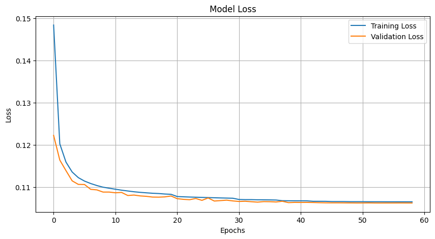
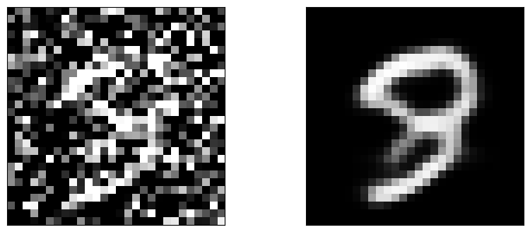

# Image Denoising Using Autoencoders
### Author: Virendrasinh Chavda

This repository contains a project to denoise images using autoencoders. The project demonstrates the use of deep learning techniques for image preprocessing, training an autoencoder, and evaluating its performance.

---

## Table of Contents
1. [Overview](#overview)
2. [Installation](#installation)
3. [Features](#features)
4. [Usage](#usage)
5. [Methodology](#methodology)
6. [Results](#results)
7. [Future Work](#future-work)
8. [Contributing](#contributing)
9. [License](#license)

---

## Overview

<p align="justify">
This project trains an autoencoder to remove noise from images. It demonstrates the effectiveness of deep learning in image preprocessing tasks and provides visualizations of the denoising process.
</p>

---

## Installation

To set up and use this project, follow these steps:

1. Clone the repository:
   ```bash
   git clone https://github.com/your-repo/image-denoising.git
   cd image-denoising
   ```
## Features

### Neural Network Training
- Built an autoencoder to denoise images.
- Trained the model with advanced techniques, including:
  - Early stopping.
  - Reduce-on-plateau learning rate adjustment.

---

## Usage

### Data Preprocessing
- Use `Image denoising.ipynb` to:
  - Load and preprocess noisy images.
  - Normalize the data for input into the autoencoder.

### Model Training and Evaluation
- Train the autoencoder using the noisy and clean image pairs.
- Evaluate the performance using accuracy and loss metrics.
- 
---

## Methodology

### Steps

#### Data Preprocessing
- Created noisy versions of images by adding random noise.
- Normalized image data for input into the neural network.

#### Model Architecture
- Designed an autoencoder with:
  - Convolutional and deconvolutional layers.
  - ReLU activation functions for encoding.
  - Sigmoid activation for decoding.

#### Training
- Used Mean Squared Error (MSE) loss and Adam optimizer.
- Implemented early stopping and learning rate adjustment.

#### Evaluation
- Visualized accuracy and loss curves:
  
  

---

## Results

### Denoised Images
- The autoencoder effectively removed noise, as shown in the comparison below:
  

---

## Future Work

### Model Improvements
- Experiment with deeper or more complex autoencoder architectures.
- Add dropout layers to improve generalization.

### Feature Engineering
- Test different noise types (e.g., Gaussian, salt-and-pepper) to improve robustness.

### Deployment
- Deploy the autoencoder as a web or mobile app for real-time image denoising.

---

## Contributing

Contributions are welcome! Feel free to fork the repository, make improvements, and submit a pull request. If you encounter any issues, open a GitHub issue for discussion.

---

## License

This project is licensed under the MIT License. See the [LICENSE](./LICENSE) file for more details.
